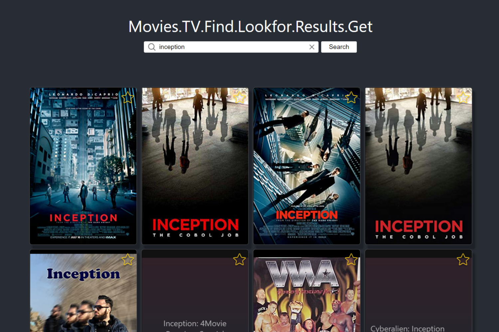
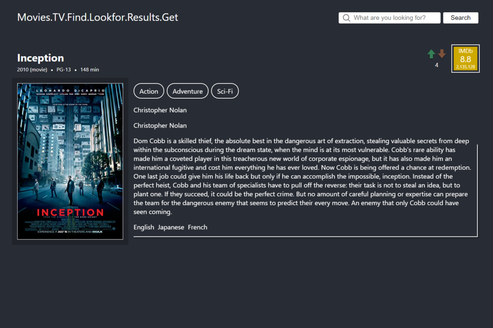

# Movie-Api-Web

This is a portfolio project meant to demonstrate graphic/web design, external API integration,
and some amount of backend competency. It was built with React and Django.

Have a look at these fine pages:

<span float="left">
  
  
</span>

The site was not designed with mobile in mind, but I am working on that.

## Running the Project
🔻 You can alternatively click [here](https://xpg-movie-api-web.herokuapp.com) to see
the official build on a public server. It *will* take a minute for Heroku to wake up the
server dyno before it serves you the page.

### Installing

You will need the python3 version of pipenv if you don't have it. And npm.  
`pip3 install pipenv`

Open a powershell in the directory of the project and run these in order:

```powershell
# Build React project
npm install;
npm run-script build;

# Environment variables
Add-Content .env.local 'BUILD_MODE=development';
Add-Content .env.local 'DATABASE_URL=sqlite:///db.sqlite3';

# Setup Django
pipenv shell;
pipenv install -r requirements.txt;
py manage.py makemigrations;
py manage.py migrate;
```

### Running

Once setup is complete, you can run the server from its directory like so:

```powershell
pipenv shell;             # Only if you haven't already.
py manage.py runserver;
```

You can tap into it by navigating to [http://localhost:8000](http://localhost:8000) in your browser.
